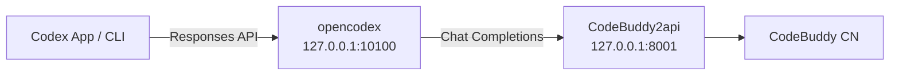

# codex-buddy

> Use **Tencent CodeBuddy** as the model backend for **OpenAI Codex**.

[English](README.md) · [简体中文](README_ZH.md)

[](LICENSE)

`codex-buddy` is a local proxy setup that bridges Codex's **Responses API** to CodeBuddy's **Chat Completions**, so you can run CodeBuddy-powered agent loops inside **Codex App** or **Codex CLI**.



---

## Why

Codex (App / CLI) dropped `wire_api="chat"` in 2026 and now only speaks **OpenAI Responses API**. CodeBuddy has no public Responses endpoint; it exposes a private chat API that the community wraps as **Chat Completions**. A local gateway is required to translate between the two.

`CodeBuddy2api` has been verified at the source level to forward `tools` / `tool_calls` transparently, so Codex's read-edit-run agent loop is preserved. End-to-end function calling still depends on whether your CodeBuddy account/model has function calling enabled.

---

## Quick Start

### 1. Start CodeBuddy2api

```bash
./scripts/setup-codebuddy2api.sh
```

The script clones [`Sliverkiss/CodeBuddy2api`](https://github.com/Sliverkiss/CodeBuddy2api), creates a Python venv, installs dependencies, and prompts you to fill `CODEBUDDY_API_KEY` in `CodeBuddy2api/.env`. Re-run the script after editing `.env` to start the proxy on `127.0.0.1:8001`.

Verify:

```bash
curl http://127.0.0.1:8001/codebuddy/v1/models
```

### 2. Register CodeBuddy with opencodex

```bash
npm install -g @bitkyc08/opencodex

ocx provider add codebuddy \
  --adapter openai-compatible \
  --base-url http://127.0.0.1:8001/codebuddy/v1 \
  --api-key dummy \
  --allow-private-network \
  --set-default \
  --sync
```

`--api-key dummy` is fine because real authentication happens inside CodeBuddy2api. `--allow-private-network` is required since CodeBuddy2api runs on `127.0.0.1`.

### 3. Start the gateway and open Codex

```bash
ocx start
```

Then open **Codex App** or run `codex`, and select the CodeBuddy model from the model picker.

---

## Let Codex Configure Itself

Copy the contents of [`PROMPT.md`](PROMPT.md) into a Codex chat. Codex will run the full setup, ask for your API key, start both background services, and verify that `tool_calls` work.

---

## Verify Tool Calling

Check that CodeBuddy returns `tool_calls`:

```bash
curl http://127.0.0.1:8001/codebuddy/v1/chat/completions \
  -H "Content-Type: application/json" \
  -d '{
    "model":"auto-chat",
    "messages":[{"role":"user","content":"calculate 1+1 with the calc tool"}],
    "tools":[{"type":"function","function":{"name":"calc","description":"calculate","parameters":{"type":"object","properties":{"expr":{"type":"string"}}}}}],
    "tool_choice":"auto"
  }'
```

If the response contains `"tool_calls"`, the chain is ready. If not, your CodeBuddy account/model does not have function calling enabled yet.

---

## Restore

To switch back to the official OpenAI model:

```bash
ocx restore
```

---

## Repository Layout

```
codex-buddy/
├── README.md                 # This file
├── README_ZH.md              # 中文版
├── PROMPT.md                 # Prompt you can paste into Codex
├── scripts/
│   └── setup-codebuddy2api.sh # Start CodeBuddy2api
├── TROUBLESHOOTING.md        # Common issues
└── LICENSE                   # MIT
```

---

## License

[MIT](LICENSE)
