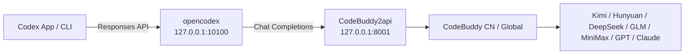
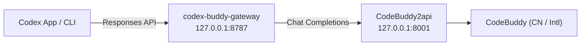

# codex-buddy

> Access most Chinese LLMs — **Kimi K3**, **Hunyuan3 (Hy3)**, **DeepSeek-V4**, **GLM-5.2**, **MiniMax-M3** — inside **OpenAI Codex** through Tencent CodeBuddy.

[English](README.md) · [简体中文](README_ZH.md)

[](LICENSE)

`codex-buddy` is a local proxy setup that wires Codex's **Responses API** to CodeBuddy's **Chat Completions**, so you can use CodeBuddy's aggregated model catalog as the brain behind Codex App / CLI.



---

## Why CodeBuddy

Instead of configuring Codex against a single model provider, CodeBuddy gives you a **unified gateway** to most domestic Chinese models:

| Model | Version | Note |
|-------|---------|------|
| **Kimi K3** | China | Latest Moonshot model; rolling out, currently prioritized for enterprise/subscribers |
| **Hy3 High** | China | Hunyuan3 reasoning model, **limited-time free** |
| **GLM-5.2 / 5.1 / 5v-Turbo** | China | Zhipu flagship series |
| **MiniMax-M3** | China | Cost-efficient daily driver |
| **Kimi-K2.7-Code / K2.6 / K2.5** | China | Coding-optimized and multimodal variants |
| **DeepSeek-V4-Pro / Flash High** | China | Reasoning models |
| **GPT-5 / Claude-4 / Gemini-2.5** | International | Available via CodeBuddy International (`codebuddy.ai`) |

CodeBuddy has **two editions**:

| Edition | Domain | Login | Typical models |
|---------|--------|-------|----------------|
| **China** | `copilot.tencent.com` | Tencent Cloud account | Kimi, Hunyuan, DeepSeek, GLM, MiniMax |
| **International** | `codebuddy.ai` | CodeBuddy account | GPT-5, Claude-4, Gemini-2.5, plus configurable OpenAI-compatible endpoints |

Both editions are supported by the proxy via `CODEBUDDY_INTERNET_ENVIRONMENT`.

---

## Quick Start

### 1. Start CodeBuddy2api

```bash
./scripts/setup-codebuddy2api.sh
```

The script clones [`Sliverkiss/CodeBuddy2api`](https://github.com/Sliverkiss/CodeBuddy2api), creates a venv, installs dependencies, and asks for your `CODEBUDDY_API_KEY`. Edit `CodeBuddy2api/.env`, then re-run the script.

To target the **International** edition, set this in `CodeBuddy2api/.env`:

```bash
CODEBUDDY_INTERNET_ENVIRONMENT=public
```

For the **China** edition (default):

```bash
CODEBUDDY_INTERNET_ENVIRONMENT=internal
```

Verify it is healthy:

```bash
curl http://127.0.0.1:8001/codebuddy/v1/models
```

### 2. Register CodeBuddy in opencodex

```bash
npm install -g @bitkyc08/opencodex

ocx provider add codebuddy \
  --adapter openai-compatible \
  --base-url http://127.0.0.1:8001/codebuddy/v1 \
  --api-key dummy \
  --allow-private-network \
  --set-default \
  --sync
```

`--api-key dummy` is fine: real authentication is handled by CodeBuddy2api. `--allow-private-network` is required because the proxy runs on `127.0.0.1`.

### 3. Start the gateway and use Codex

```bash
ocx start
```

Open **Codex App** or run `codex`. CodeBuddy models now appear in the model picker.

---

## Select a Specific Model

Use opencodex's `provider/model` routing:

```bash
# CLI
 codex -m "codebuddy/kimi-k3" "refactor this function"
 codex -m "codebuddy/hy3-high" "explain this algorithm"
```

In **Codex App**, pick the model directly from the picker. To browse available models visually, run:

```bash
ocx gui
```

---

## Let Codex Configure Itself

Copy the contents of [`PROMPT.md`](PROMPT.md) into a Codex chat. Codex will install, configure, start, and verify the proxy automatically.

---

## Run opencodex as a Local Background Service

> Note: `opencodex` is a separate community open-source project (installed via npm). This section only describes how to use its background-service feature; it is not our code or service.

So you don't need to keep a terminal open:

```bash
ocx service install
ocx service start
```

Stop or restore at any time:

```bash
ocx stop        # stop proxy and restore native Codex
ocx restore     # restore Codex config without stopping
```

---

## Verify Tool Calling

Confirm CodeBuddy returns `tool_calls` before relying on agent features:

```bash
curl http://127.0.0.1:8001/codebuddy/v1/chat/completions \
  -H "Content-Type: application/json" \
  -d '{
    "model":"auto-chat",
    "messages":[{"role":"user","content":"calculate 1+1 with the calc tool"}],
    "tools":[{"type":"function","function":{"name":"calc","description":"calculate","parameters":{"type":"object","properties":{"expr":{"type":"string"}}}}}],
    "tool_choice":"auto"
  }'
```

If the response contains `"tool_calls"`, Codex can read, edit, and execute. If not, your CodeBuddy account/model does not have function calling enabled.

---

## Bridge Without opencodex: codex-buddy-gateway

If you prefer not to install `opencodex`, the repo ships a lightweight gateway, `codex-buddy-gateway.py`. It translates Codex's **Responses API** (`/v1/responses`) into CodeBuddy2api's **Chat Completions** (`/v1/chat/completions`) in real time — including streaming `tool_calls` translation so Codex can use tools normally.



### 1. Install dependencies

```bash
pip install -r requirements.txt
```

### 2. Start the gateway

```bash
python codex-buddy-gateway.py
# Listens on http://127.0.0.1:8787/v1, upstream http://127.0.0.1:8001/codebuddy/v1
```

Override with env vars: `CODEBUDDY_BASE_URL`, `CODEBUDDY_API_KEY`, `CODEBUDDY_MODEL` (default `kimi-k3`), `GATEWAY_HOST`, `GATEWAY_PORT` (default `8787`).

### 3. Point Codex at the gateway

Set Codex's API Base to `http://127.0.0.1:8787/v1` and use Responses mode (`wire_api = "responses"`). Model names follow CodeBuddy's naming (`kimi-k3`, `hy3-high`, ...).

### 4. Verify

```bash
curl http://127.0.0.1:8787/health
curl http://127.0.0.1:8787/v1/models
python test_gateway_dryrun.py   # mock upstream; no real model needed
```

---

## GPT-Kimi Orchestrator

If you want GPT to act as the director and Kimi as the actor, use `gpt-kimi-orchestrator.py`. It splits work into **plan → delegate → review**:

1. **Plan**: GPT breaks the request into sub-tasks and assigns a model to each.
2. **Delegate**: Each sub-task is sent to a CodeBuddy model (default `kimi-k3`).
3. **Review**: GPT synthesizes the sub-task results into the final answer.

### Install dependencies

```bash
pip install -r requirements.txt
```

### Configuration

Environment variables (or a `.env` file):

```bash
export OPENAI_API_KEY="sk-..."           # key for the orchestrator GPT
export ORCHESTRATOR_MODEL="gpt-4o-mini"  # orchestrator model

# Worker defaults to the local CodeBuddy2api endpoint
export WORKER_BASE_URLS="http://127.0.0.1:8001/codebuddy/v1"
```

Multi-account failover:

```bash
export WORKER_BASE_URLS="http://127.0.0.1:8001/codebuddy/v1,http://127.0.0.1:8002/codebuddy/v1"
export WORKER_API_KEYS="dummy,dummy"
export WORKER_ACCOUNT_NAMES="account-a,account-b"
```

### Usage

```bash
python gpt-kimi-orchestrator.py "Write a Python script that converts Markdown to PDF"
```

### Common scenarios

#### 1. How do I use Kimi K3?

Set the default worker model:

```bash
export WORKER_DEFAULT_MODEL="kimi-k3"
```

Or simply mention it in the task, e.g. "Refactor this function using Kimi K3."

#### 2. How do I fall back to the limited-time free Hy3 when Kimi has no quota?

```bash
export WORKER_DEFAULT_MODEL="kimi-k3"
export WORKER_FALLBACK_MODEL="hy3-high"
```

When `kimi-k3` fails due to quota or rate limits, the orchestrator automatically falls back to `hy3-high`.

### Token tracking and account switching

- Tracks `prompt_tokens` / `completion_tokens` after every call.
- Marks an account as exhausted on `429` or quota-related `403`, then tries the next one.
- If all accounts fail, it falls back to the fallback model.

---

## Repository Layout

```
codex-buddy/
├── README.md                 # This file
├── README_ZH.md              # 简体中文
├── PROMPT.md                 # Paste into Codex to auto-configure
├── requirements.txt          # Python dependencies
├── gpt-kimi-orchestrator.py  # Standalone GPT-Kimi orchestrator
├── codex-buddy-gateway.py    # /v1/responses → /v1/chat/completions bridge (no opencodex)
├── test_gateway_dryrun.py    # Gateway dry-run test (mock upstream)
├── scripts/
│   └── setup-codebuddy2api.sh # Start CodeBuddy2api
├── TROUBLESHOOTING.md        # Common issues
└── LICENSE                   # MIT
```

---

## Third-party Dependencies

- `opencodex`: A community-maintained local proxy (npm package `@bitkyc08/opencodex` / `lidge-jun/opencodex`) that translates Codex's Responses API into third-party model protocols. It is installed independently via npm and is governed by its own license.
- `CodeBuddy2api`: [`Sliverkiss/CodeBuddy2api`](https://github.com/Sliverkiss/CodeBuddy2api), which wraps the official CodeBuddy API as an OpenAI-compatible interface. It is installed independently via Git and is governed by its own license.

`codex-buddy` does not include the source code of either project; it only provides configuration and scripts to connect them.

---

## License

[MIT](LICENSE)
