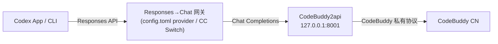

# codex-buddy

> 在 **OpenAI Codex（桌面端 App / CLI 通用）** 里接入 **腾讯 CodeBuddy**，让 Codex 的 agent 循环跑在 CodeBuddy 模型上。

[](LICENSE)

---

## 这是什么

`codex-buddy` 是一份**经过源码级验证**的本地代理方案：

- 把 Codex 的 **Responses API** 流量翻译成 **OpenAI Chat Completions**，再转发到 CodeBuddy 的模型后端；
- 使 Codex（桌面 App 或 CLI）能够调用 CodeBuddy 模型来读代码、改文件、执行命令；
- **不破解任何私有协议**，所有调用都走 CodeBuddy 官方 API / 开放平台 Key。

> **代理层已确认透传 `tools` / `tool_calls`**（见[下方源码级说明](#工具调用透传确认源码级））。端到体验证（Codex App 里实际跑一个任务）需要你本地完成，因为每个人的 CodeBuddy 账号/模型开通情况不同。

---

## 适用对象

- **Codex 桌面端 App**（macOS / Windows / Linux）
- **Codex CLI**

两者共用同一份 `~/.codex/config.toml` 与 `model_providers` 机制（官方文档：*agents in the app inherit the same config*），所以配置一次即可双端使用。

---

## 核心问题：协议断层

| 角色 | 协议 |
|------|------|
| **Codex（App / CLI，2026 起）** | 只认 **OpenAI Responses API**（`/v1/responses`），已彻底移除 `wire_api = "chat"` |
| **CodeBuddy** | 无公开 Responses 端点，只有私有聊天接口；社区封装为 **OpenAI Chat Completions**（`/v1/chat/completions`） |

Codex 与 CodeBuddy 协议不互通，因此必须在本地加一层「**Responses API → Chat Completions**」翻译网关：



- **网关层**：把 Codex 的 Responses 协议翻译成 Chat Completions，并透传 `tool_calls`（Codex 的 agent 循环依赖工具调用，缺了就退化成纯聊天）。
- **代理层**：把 CodeBuddy 私有聊天 API 暴露成 OpenAI 兼容接口，并提供鉴权。

---

## 两套落地方案

两者底层都依赖同一对组件：**`CodeBuddy2api` + 一个 Responses 网关**。区别只在"网关以什么形式接入 Codex"。

| 方案 | 网关形式 | 是否改 `~/.codex/config.toml` | 适合人群 |
|------|----------|------------------------------|----------|
| **A（推荐）** | 直接在 `~/.codex/config.toml` 写自定义 `model_providers`（`wire_api="responses"`） | ✅ 写一次 | 想用官方原生机制、最稳 |
| **B（零配置）** | [**CC Switch**](https://github.com/farion1231/cc-switch) 桌面端本地路由，网络层透明代理 | ❌ 不改 | 不想碰 config、想可视化切模型 |

> 另有纯 CLI 网关 [**opencodex**](https://github.com/lidge-jun/opencodex)（`ocx`）可作为方案 A 的变体：它自动帮你写入 `wire_api=responses` 的 provider。本质同方案 A，默认端口 **10100**。

---

## 前置准备：起 CodeBuddy2api

无论选方案 A 还是 B，第一步都是把 CodeBuddy 的接口变成 OpenAI 兼容的 Chat Completions。

使用 [`Sliverkiss/CodeBuddy2api`](https://github.com/Sliverkiss/CodeBuddy2api)：

```bash
git clone https://github.com/Sliverkiss/CodeBuddy2api
cd CodeBuddy2api
python3 -m venv venv && source venv/bin/activate
pip install -r requirements.txt

# 推荐 API Key 模式（最稳）
cp .env.example .env
# 编辑 .env，填入：
#   CODEBUDDY_AUTH_MODE=api_key
#   CODEBUDDY_API_KEY=你的CodeBuddy开放平台Key

python web.py
```

- 监听 `http://127.0.0.1:8001`
- 接口 `http://127.0.0.1:8001/codebuddy/v1/chat/completions`

> 也可以用本仓库提供的 [`scripts/setup-codebuddy2api.sh`](scripts/setup-codebuddy2api.sh) 一键克隆、建 `.env` 并启动。

---

## 方案 A：config.toml 直配（Codex App / CLI 通用 ⭐）

这是最贴近官方机制的用法。Codex 桌面 App 启动时会读取 `~/.codex/config.toml`，自定义 `model_providers` 里的 provider 会直接出现在 App 的模型选择器里。

### 步骤

**1. 起一个 Responses→Chat 网关**

把 `http://127.0.0.1:8001/codebuddy/v1`（Chat）包成 Responses API。最简做法是用 **opencodex**：

```bash
npm i -g opencodex
ocx init
# 交互式配置：provider 选 "Custom / OpenAI 兼容"，
# base_url 填 http://127.0.0.1:8001/codebuddy/v1，端口默认 10100
ocx start
```

opencodex 默认监听 `http://127.0.0.1:10100`，对外暴露 `/v1/responses`。

**2. 写入 `~/.codex/config.toml`**

完整示例（已包含常用安全与超时参数）：

```toml
# ~/.codex/config.toml
model = "auto-chat"
model_provider = "codebuddy"

[model_providers.codebuddy]
name = "CodeBuddy"
base_url = "http://127.0.0.1:10100/v1"
wire_api = "responses"
env_key = "CODEBUDDY_PROXY_KEY"
env_key_instructions = "任意非空值即可，真正鉴权在 CodeBuddy2api 层"
request_max_retries = 4
stream_max_retries = 5
stream_idle_timeout_ms = 300000
```

环境变量：

```bash
export CODEBUDDY_PROXY_KEY=local
```

> `auto-chat` 是 CodeBuddy2api 的默认模型名。如果你的 `.env` 里配置了 `CODEBUDDY_MODELS`，或者 CodeBuddy 后端返回了别的可用模型名，请替换为实际值。

**3. 打开 Codex**

- **Codex App**：用 ChatGPT 账号登录后，在模型选择器里选 `auto-chat`（或你配置的 `model`）。App 会读取 `~/.codex/config.toml`，自定义 provider 已出现在列表里。
- **Codex CLI**：直接 `codex`，默认走 `codebuddy/auto-chat`。

---

## 方案 B：CC Switch 透明代理（零 `config.toml` 改动）

[**CC Switch**](https://github.com/farion1231/cc-switch) 是一款跨平台桌面应用，统一管理 Claude Code、Codex、Gemini CLI 等工具的 Provider。它对 Codex **透明代理**：Codex 以为自己还在连 OpenAI 官方，实际流量被转到你配的后端。因为是网络层拦截，**Codex App 和 CLI 都适用**，且完全不用改 `config.toml`。

### 步骤

1. 按[前置准备](#前置准备起-codebuddy2api)起好 `CodeBuddy2api`（`127.0.0.1:8001`）。
2. 安装 CC Switch：

   ```bash
   brew install --cask cc-switch
   # 或去官网 https://ccswitch.ai/zh/ 下载安装包
   ```

3. 打开 CC Switch：
   - 顶部切到 **Codex**；
   - 左侧 `Providers` → `+ Add Provider`，选 **Custom / OpenAI 兼容**：
     - **Base URL**：`http://127.0.0.1:8001/codebuddy/v1`
     - **API Key**：任意非空串（真正鉴权在 CodeBuddy2api 层）
     - **Model**：`auto-chat`（或你配置的模型名）
   - 开启 **Local Routing（本地路由映射）**，保存，确认状态绿色。
4. 打开 **Codex App**（或跑 `codex`）——请求已被透明转发到 CodeBuddy，模型列表里会出现你配的模型。

> 方案 B 比方案 A 少改一处 config，但多装一个桌面程序；方案 A 是官方原生机制、最可控。

---

## 工具调用透传确认（源码级 ✅）

> 已直接阅读 `Sliverkiss/CodeBuddy2api` 的 `src/codebuddy_router.py` 验证。

**入站（`tools` 透传）**：`RequestProcessor.prepare_payload()` 是 `payload = request_body.copy()` 后强制 `payload["stream"] = True`，不做字段裁剪——请求体里的 `tools` / `tool_choice` 原样发往 CodeBuddy 官方 `/v2/chat/completions`。

**出站（`tool_calls` 回传）**：响应侧有完整实现（Adapter 模式，非简单透传）：

- `convert_sse_chunk_to_openai_format()`：把 CodeBuddy 的 `tooluse_*` ID 转成 OpenAI 的 `call_*` 格式，并维护 `index` 映射重分配（CodeBuddy 自身不提供稳定 index）。
- `StreamResponseAggregator`：以 tool call ID 为键聚合分块流，正确处理**多工具并发调用**，流式结束后拼出完整 `tool_calls` 数组；`finish_reason` 自动置为 `"tool_calls"`。
- `validate_and_fix_tool_call_args()`：修复流截断导致的 JSON 不完整（含多 JSON 对象粘连的边界情况）。

**结论**：代理层在工具调用维度上**已确认可用**。Codex 的 agent 循环理论上能真正读写文件、执行命令。唯一外部变量是 **CodeBuddy 官方 API 是否真正开通 function calling**（取决于你账号/模型），由后端能力决定，代理层已无障碍。

---

## 本地自检（可选）

起好 CodeBuddy2api 后，确认后端确实返回 `tool_calls`：

```bash
curl http://127.0.0.1:8001/codebuddy/v1/chat/completions \
  -H "Content-Type: application/json" \
  -d '{
    "model":"auto-chat",
    "messages":[{"role":"user","content":"用计算器算 1+1"}],
    "tools":[{"type":"function","function":{"name":"calc","description":"计算","parameters":{"type":"object","properties":{"expr":{"type":"string"}}}}}],
    "tool_choice":"auto"
  }'
```

- 返回里出现 `"tool_calls"` → 后端已开通 function calling，**整链确定可用**。
- 只有普通文本、无 `tool_calls` → 后端模型未开通 function calling（换支持工具调用的模型/账号），代理层无需改动。

---

## 端到端验证（Codex App 内）

完成配置后，在 Codex App 里发起一个需要工具调用的任务，例如：

> "把当前目录下的 README.md 第一行改成 '# Hello CodeBuddy'，然后运行 `cat README.md` 给我看结果。"

如果 Codex 成功：
1. 读取 `README.md`；
2. 写入修改；
3. 执行 `cat README.md`；
4. 把结果展示给你。

说明整条链路（Codex → 网关 → CodeBuddy2api → CodeBuddy）**端到端可用**。

---

## 注意事项

- **Codex App 登录**：App 仍需 ChatGPT 账号登录才能启动；配置第三方 Provider 后，**保留登录、但 API 请求走 CodeBuddy** 是官方支持的模式。
- **鉴权**：CodeBuddy2api 支持 `CODEBUDDY_AUTH_MODE=api_key`（推荐，直接用 CodeBuddy 开放平台 Key）或 Web 页 OAuth 自动获取。
- **端口冲突**：CodeBuddy2api 默认 `8001`；opencodex 默认 `10100`；CC Switch 走系统代理端口，注意别撞车。
- **合规**：本方案为本地代理 + 个人账号调用，请遵守 CodeBuddy / Codex 各自的服务条款；个别上游项目标明了 Non-Commercial 许可，注意使用场景。
- **版本漂移**：Codex 在 2026 年频繁改协议（移除 `wire_api=chat`、合并进 ChatGPT Desktop 等）。若某天 Codex 报错 `wire_api not supported`，第一反应是确认你的网关仍对外提供 **Responses API**，而不是改回 chat。

---

## 目录结构

```
codex-buddy/
├── README.md                 # 本文件
├── config-example.toml       # ~/.codex/config.toml 示例（方案 A）
├── scripts/
│   └── setup-codebuddy2api.sh # 一键克隆、配置、启动 CodeBuddy2api
├── TROUBLESHOOTING.md        # 常见问题排查
└── LICENSE                   # MIT
```

---

## License

[MIT](LICENSE)
