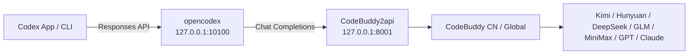

# codex-buddy

> Access most Chinese LLMs — **Kimi K3**, **Hunyuan3 (Hy3)**, **DeepSeek-V4**, **GLM-5.2**, **MiniMax-M3** — inside **OpenAI Codex** through Tencent CodeBuddy.

[English](README.md) · [简体中文](README_ZH.md)

[](LICENSE)

`codex-buddy` is a local proxy setup that wires Codex's **Responses API** to CodeBuddy's **Chat Completions**, so you can use CodeBuddy's aggregated model catalog as the brain behind Codex App / CLI.



---

## Why CodeBuddy

Instead of configuring Codex against a single model provider, CodeBuddy gives you a **unified gateway** to most domestic Chinese models:

| Model | Version | Note |
|-------|---------|------|
| **Kimi K3** | China | Latest Moonshot model; rolling out, currently prioritized for enterprise/subscribers |
| **Hy3 High** | China | Hunyuan3 reasoning model, **limited-time free** |
| **GLM-5.2 / 5.1 / 5v-Turbo** | China | Zhipu flagship series |
| **MiniMax-M3** | China | Cost-efficient daily driver |
| **Kimi-K2.7-Code / K2.6 / K2.5** | China | Coding-optimized and multimodal variants |
| **DeepSeek-V4-Pro / Flash High** | China | Reasoning models |
| **GPT-5 / Claude-4 / Gemini-2.5** | International | Available via CodeBuddy International (`codebuddy.ai`) |

CodeBuddy has **two editions**:

| Edition | Domain | Login | Typical models |
|---------|--------|-------|----------------|
| **China** | `copilot.tencent.com` | Tencent Cloud account | Kimi, Hunyuan, DeepSeek, GLM, MiniMax |
| **International** | `codebuddy.ai` | CodeBuddy account | GPT-5, Claude-4, Gemini-2.5, plus configurable OpenAI-compatible endpoints |

Both editions are supported by the proxy via `CODEBUDDY_INTERNET_ENVIRONMENT`.

---

## Quick Start

### 1. Start CodeBuddy2api

```bash
./scripts/setup-codebuddy2api.sh
```

The script clones [`Sliverkiss/CodeBuddy2api`](https://github.com/Sliverkiss/CodeBuddy2api), creates a venv, installs dependencies, and asks for your `CODEBUDDY_API_KEY`. Edit `CodeBuddy2api/.env`, then re-run the script.

To target the **International** edition, set this in `CodeBuddy2api/.env`:

```bash
CODEBUDDY_INTERNET_ENVIRONMENT=public
```

For the **China** edition (default):

```bash
CODEBUDDY_INTERNET_ENVIRONMENT=internal
```

Verify it is healthy:

```bash
curl http://127.0.0.1:8001/codebuddy/v1/models
```

### 2. Register CodeBuddy in opencodex

```bash
npm install -g @bitkyc08/opencodex

ocx provider add codebuddy \
  --adapter openai-compatible \
  --base-url http://127.0.0.1:8001/codebuddy/v1 \
  --api-key dummy \
  --allow-private-network \
  --set-default \
  --sync
```

`--api-key dummy` is fine: real authentication is handled by CodeBuddy2api. `--allow-private-network` is required because the proxy runs on `127.0.0.1`.

### 3. Start the gateway and use Codex

```bash
ocx start
```

Open **Codex App** or run `codex`. CodeBuddy models now appear in the model picker.

---

## Select a Specific Model

Use opencodex's `provider/model` routing:

```bash
# CLI
 codex -m "codebuddy/kimi-k3" "refactor this function"
 codex -m "codebuddy/hy3-high" "explain this algorithm"
```

In **Codex App**, pick the model directly from the picker. To browse available models visually, run:

```bash
ocx gui
```

---

## Let Codex Configure Itself

Copy the contents of [`PROMPT.md`](PROMPT.md) into a Codex chat. Codex will install, configure, start, and verify the proxy automatically.

---

## Run opencodex as a Background Service

So you don't need to keep a terminal open:

```bash
ocx service install
ocx service start
```

Stop or restore at any time:

```bash
ocx stop        # stop proxy and restore native Codex
ocx restore     # restore Codex config without stopping
```

---

## Verify Tool Calling

Confirm CodeBuddy returns `tool_calls` before relying on agent features:

```bash
curl http://127.0.0.1:8001/codebuddy/v1/chat/completions \
  -H "Content-Type: application/json" \
  -d '{
    "model":"auto-chat",
    "messages":[{"role":"user","content":"calculate 1+1 with the calc tool"}],
    "tools":[{"type":"function","function":{"name":"calc","description":"calculate","parameters":{"type":"object","properties":{"expr":{"type":"string"}}}}}],
    "tool_choice":"auto"
  }'
```

If the response contains `"tool_calls"`, Codex can read, edit, and execute. If not, your CodeBuddy account/model does not have function calling enabled.

---

## Repository Layout

```
codex-buddy/
├── README.md                 # This file
├── README_ZH.md              # 简体中文
├── PROMPT.md                 # Paste into Codex to auto-configure
├── scripts/
│   └── setup-codebuddy2api.sh # Start CodeBuddy2api
├── TROUBLESHOOTING.md        # Common issues
└── LICENSE                   # MIT
```

---

## License

[MIT](LICENSE)
