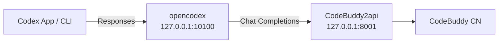

# codex-buddy

> 让 **OpenAI Codex** 跑在 **腾讯 CodeBuddy** 上。

[](LICENSE)

## 一句话

`codex-buddy` 是一个本地代理配置仓库：把 Codex 的 Responses API 请求转成 CodeBuddy 能理解的 Chat Completions，从而让你在 **Codex 桌面端 App / CLI** 里使用 CodeBuddy 模型驱动整个 agent 循环（读文件、改代码、跑命令）。

## 为什么需要它

Codex（App / CLI）从 2026 年起只支持 **OpenAI Responses API**，而 CodeBuddy 只提供 **Chat Completions**。两者协议不互通，中间必须有一层翻译网关。



代理层 `CodeBuddy2api` 已确认透传 `tools` / `tool_calls`，Codex 的工具调用链理论上完整。端到体验证取决于你的 CodeBuddy 账号/模型是否开通 function calling。

## 快速开始

### 1. 启动 CodeBuddy2api

```bash
# 方式一：用本仓库脚本一键启动
./scripts/setup-codebuddy2api.sh
# 按提示在 CodeBuddy2api/.env 填入你的 CODEBUDDY_API_KEY，然后重新运行该脚本

# 方式二：手动
# git clone https://github.com/Sliverkiss/CodeBuddy2api
# cd CodeBuddy2api && python3 -m venv venv && source venv/bin/activate
# pip install -r requirements.txt && cp .env.example .env
# # 编辑 .env 填入 CODEBUDDY_API_KEY
# python web.py
```

确认启动成功：

```bash
curl http://127.0.0.1:8001/codebuddy/v1/models
```

### 2. 启动 Responses → Chat 网关

```bash
npm i -g opencodex
ocx init    # 选 Custom / OpenAI 兼容，后端填 http://127.0.0.1:8001/codebuddy/v1
ocx start   # 默认监听 127.0.0.1:10100
```

### 3. 配置 Codex

```bash
cp config-example.toml ~/.codex/config.toml
# 确认 base_url 与 ocx start 显示的端口一致，默认 10100
export CODEBUDDY_PROXY_KEY=local
```

`config-example.toml` 内容：

```toml
model = "auto-chat"
model_provider = "codebuddy"

[model_providers.codebuddy]
name = "CodeBuddy"
base_url = "http://127.0.0.1:10100/v1"
wire_api = "responses"
env_key = "CODEBUDDY_PROXY_KEY"
```

### 4. 打开 Codex 并使用

- **Codex App**：登录后，在模型选择器里选 `auto-chat`。
- **Codex CLI**：直接运行 `codex`。

## 验证工具调用

确认 CodeBuddy 后端会返回 `tool_calls`：

```bash
curl http://127.0.0.1:8001/codebuddy/v1/chat/completions \
  -H "Content-Type: application/json" \
  -d '{
    "model":"auto-chat",
    "messages":[{"role":"user","content":"用计算器算 1+1"}],
    "tools":[{"type":"function","function":{"name":"calc","description":"计算","parameters":{"type":"object","properties":{"expr":{"type":"string"}}}}}],
    "tool_choice":"auto"
  }'
```

返回含 `"tool_calls"` 表示后端已开通 function calling，Codex 才能真的帮你改文件、跑命令。

## 不想改 config.toml？

用 [CC Switch](https://github.com/farion1231/cc-switch) 做透明代理：启动后把 `http://127.0.0.1:8001/codebuddy/v1` 配成 Custom Provider，然后直接打开 Codex，零 `config.toml` 改动。

## 目录

```
codex-buddy/
├── README.md                 # 本文件
├── config-example.toml       # Codex 配置模板
├── scripts/
│   └── setup-codebuddy2api.sh # 一键启动 CodeBuddy2api
├── TROUBLESHOOTING.md        # 常见问题
└── LICENSE                   # MIT
```

## License

[MIT](LICENSE)
