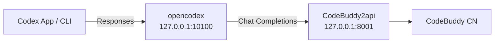

# codex-buddy

> 让 **OpenAI Codex** 跑在 **腾讯 CodeBuddy** 上。

[](LICENSE)

## 一句话

`codex-buddy` 是一份可执行的配置/脚本：把 Codex 的 Responses API 请求转发到 CodeBuddy 的 Chat Completions 接口，让你在 **Codex 桌面端 App / CLI** 里使用 CodeBuddy 模型。

## 为什么需要它

Codex（App / CLI）从 2026 年起只支持 **OpenAI Responses API**，而 CodeBuddy 只提供 **Chat Completions**。两者协议不互通，中间需要一层本地网关。



`CodeBuddy2api` 已确认透传 `tools` / `tool_calls`，Codex 的 agent 循环理论上完整。端到体验证取决于你的 CodeBuddy 账号/模型是否开通 function calling。

## 快速开始

### 1. 启动 CodeBuddy2api

```bash
./scripts/setup-codebuddy2api.sh
```

脚本会克隆 [`Sliverkiss/CodeBuddy2api`](https://github.com/Sliverkiss/CodeBuddy2api)、创建虚拟环境、安装依赖，并提示你填写 `CODEBUDDY_API_KEY`。填完后再次运行脚本即可启动，默认监听 `127.0.0.1:8001`。

确认启动成功：

```bash
curl http://127.0.0.1:8001/codebuddy/v1/models
```

### 2. 把 CodeBuddy 注册到 opencodex

```bash
npm install -g @bitkyc08/opencodex

ocx provider add codebuddy \
  --adapter openai-compatible \
  --base-url http://127.0.0.1:8001/codebuddy/v1 \
  --api-key dummy \
  --allow-private-network \
  --set-default \
  --sync
```

`--api-key dummy` 是因为真实鉴权在 CodeBuddy2api 层处理；`--sync` 会自动把模型同步进 Codex 配置。

### 3. 启动网关并打开 Codex

```bash
ocx start
```

然后打开 **Codex App** 或运行 `codex`，模型列表里选择 CodeBuddy 模型即可。

## 交给 Codex 自己跑

把 [`PROMPT.md`](PROMPT.md) 的内容复制进 Codex 聊天，Codex 会按步骤自动完成安装、配置和启动。

## 验证工具调用

确认 CodeBuddy 后端会返回 `tool_calls`：

```bash
curl http://127.0.0.1:8001/codebuddy/v1/chat/completions \
  -H "Content-Type: application/json" \
  -d '{
    "model":"auto-chat",
    "messages":[{"role":"user","content":"用计算器算 1+1"}],
    "tools":[{"type":"function","function":{"name":"calc","description":"计算","parameters":{"type":"object","properties":{"expr":{"type":"string"}}}}}],
    "tool_choice":"auto"
  }'
```

返回含 `"tool_calls"` 表示后端已开通 function calling，Codex 才能真的帮你改文件、跑命令。

## 还原

如果你想切回 OpenAI 官方模型：

```bash
ocx restore
```

## 目录

```
codex-buddy/
├── README.md                 # 本文件
├── PROMPT.md                 # 可直接丢给 Codex 的执行指令
├── scripts/
│   └── setup-codebuddy2api.sh # 一键启动 CodeBuddy2api
├── TROUBLESHOOTING.md        # 常见问题
└── LICENSE                   # MIT
```

## License

[MIT](LICENSE)
