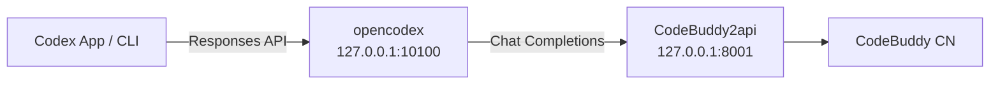

# codex-buddy

> 让 **OpenAI Codex** 使用 **腾讯 CodeBuddy** 作为模型后端。

[English](README.md) · [简体中文](README_ZH.md)

[](LICENSE)

`codex-buddy` 是一套本地代理配置，把 Codex 的 **Responses API** 桥接到 CodeBuddy 的 **Chat Completions**，让你在 **Codex 桌面端 App** 或 **Codex CLI** 里跑 CodeBuddy 驱动的 agent 循环。



---

## 为什么需要它

Codex（App / CLI）从 2026 年起移除了 `wire_api="chat"`，只支持 **OpenAI Responses API**。CodeBuddy 没有公开的 Responses 端点，只提供由社区封装成 **Chat Completions** 的私有聊天接口。中间必须有一层本地网关做协议翻译。

`CodeBuddy2api` 已在源码层面确认会透传 `tools` / `tool_calls`，Codex 的读-改-跑 agent 循环得以保留。端到端的 function calling 最终仍取决于你的 CodeBuddy 账号/模型是否开通了工具调用。

---

## 快速开始

### 1. 启动 CodeBuddy2api

```bash
./scripts/setup-codebuddy2api.sh
```

脚本会克隆 [`Sliverkiss/CodeBuddy2api`](https://github.com/Sliverkiss/CodeBuddy2api)、创建 Python 虚拟环境、安装依赖，并提示你在 `CodeBuddy2api/.env` 中填入 `CODEBUDDY_API_KEY`。编辑完 `.env` 后再次运行脚本即可启动代理，监听 `127.0.0.1:8001`。

验证：

```bash
curl http://127.0.0.1:8001/codebuddy/v1/models
```

### 2. 将 CodeBuddy 注册到 opencodex

```bash
npm install -g @bitkyc08/opencodex

ocx provider add codebuddy \
  --adapter openai-compatible \
  --base-url http://127.0.0.1:8001/codebuddy/v1 \
  --api-key dummy \
  --allow-private-network \
  --set-default \
  --sync
```

`--api-key dummy` 即可，真实鉴权在 CodeBuddy2api 层处理；`--allow-private-network` 必须加，因为 CodeBuddy2api 跑在本地 `127.0.0.1`。

### 3. 启动网关并打开 Codex

```bash
ocx start
```

然后打开 **Codex App** 或运行 `codex`，在模型选择器里选择 CodeBuddy 模型即可。

---

## 让 Codex 自己完成配置

把 [`PROMPT.md`](PROMPT.md) 的内容复制进 Codex 聊天，Codex 会自动完成安装、询问 API Key、启动两个后台服务，并验证 `tool_calls` 是否正常工作。

---

## 验证工具调用

确认 CodeBuddy 会返回 `tool_calls`：

```bash
curl http://127.0.0.1:8001/codebuddy/v1/chat/completions \
  -H "Content-Type: application/json" \
  -d '{
    "model":"auto-chat",
    "messages":[{"role":"user","content":"用 calc 工具计算 1+1"}],
    "tools":[{"type":"function","function":{"name":"calc","description":"计算","parameters":{"type":"object","properties":{"expr":{"type":"string"}}}}}],
    "tool_choice":"auto"
  }'
```

如果返回包含 `"tool_calls"`，整条链路已就绪；否则说明你的 CodeBuddy 账号/模型尚未开通 function calling。

---

## 还原

切回 OpenAI 官方模型：

```bash
ocx restore
```

---

## 仓库结构

```
codex-buddy/
├── README.md                 # 英文版
├── README_ZH.md              # 本文件
├── PROMPT.md                 # 可直接粘贴给 Codex 的执行指令
├── scripts/
│   └── setup-codebuddy2api.sh # 启动 CodeBuddy2api
├── TROUBLESHOOTING.md        # 常见问题
└── LICENSE                   # MIT
```

---

## License

[MIT](LICENSE)
