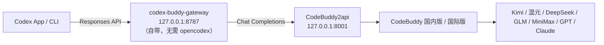
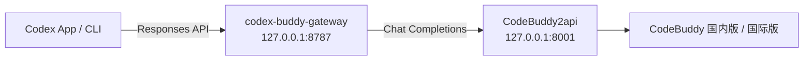

# codex-buddy

> 在 **OpenAI Codex** 里通过 **腾讯 CodeBuddy** 一次性使用大部分国产大模型：**Kimi K3**、**混元 Hy3**、**DeepSeek-V4**、**GLM-5.2**、**MiniMax-M3** 等。

[English](README.md) · [简体中文](README_ZH.md)

[](LICENSE)

`codex-buddy` 是一套本地代理配置，把 Codex 的 **Responses API** 桥接到 CodeBuddy 的 **Chat Completions**，让你能在 **Codex 桌面端 App / CLI** 里把 CodeBuddy 聚合的模型库当作 Codex 的大脑。



---

## 为什么用 CodeBuddy

与其在 Codex 里单独配置一个个模型商，不如通过 CodeBuddy 这个**统一网关**直接接入大部分国产大模型：

| 模型 | 版本 | 说明 |
|------|------|------|
| **Kimi K3** | 国内版 | Moonshot 最新模型；逐步放量，目前优先企业/订阅用户 |
| **Hy3 High** | 国内版 | 混元三代推理模型，**限时免费** |
| **GLM-5.2 / 5.1 / 5v-Turbo** | 国内版 | 智谱旗舰系列 |
| **MiniMax-M3** | 国内版 | 高性价比日常模型 |
| **Kimi-K2.7-Code / K2.6 / K2.5** | 国内版 | 编程优化与多模态版本 |
| **DeepSeek-V4-Pro / Flash High** | 国内版 | 推理模型 |
| **GPT-5 / Claude-4 / Gemini-2.5** | 国际版 | 通过 CodeBuddy 国际版 (`codebuddy.ai`) 使用 |

CodeBuddy 有**两个版本**：

| 版本 | 域名 | 登录 | 主要模型 |
|------|------|------|----------|
| **国内版** | `copilot.tencent.com` | 腾讯云账号 | Kimi、混元、DeepSeek、GLM、MiniMax |
| **国际版** | `codebuddy.ai` | CodeBuddy 账号 | GPT-5、Claude-4、Gemini-2.5，以及可配置的 OpenAI 兼容端点 |

两个版本都可通过 `CODEBUDDY_INTERNET_ENVIRONMENT` 由同一代理接入。

---

## 快速开始

把 CodeBuddy 接进 Codex 有**两条路径**，二者都从「启动 CodeBuddy2api」开始：

- **路径一（推荐，零额外依赖）**：用仓库自带的 `codex-buddy-gateway.py`，把 Responses API 翻译成 Chat Completions，**无需安装 opencodex**。
- **路径二**：用社区工具 `opencodex` 做代理（需要 Node.js / npm）。

### 0. 启动 CodeBuddy2api（两条路径共用）

```bash
./scripts/setup-codebuddy2api.sh
```

脚本会克隆 [`Sliverkiss/CodeBuddy2api`](https://github.com/Sliverkiss/CodeBuddy2api)、创建 Python 虚拟环境、安装依赖，并提示你填写 `CODEBUDDY_API_KEY`。编辑完 `CodeBuddy2api/.env` 后再次运行脚本即可启动，监听 `127.0.0.1:8001`。

如需使用**国际版**，在 `CodeBuddy2api/.env` 中设置：

```bash
CODEBUDDY_INTERNET_ENVIRONMENT=public
```

使用**国内版**（默认）：

```bash
CODEBUDDY_INTERNET_ENVIRONMENT=internal
```

验证启动成功：

```bash
curl http://127.0.0.1:8001/codebuddy/v1/models
```

### 路径一：codex-buddy-gateway（推荐，无需 opencodex）

```bash
pip install -r requirements.txt
python codex-buddy-gateway.py
# 监听 http://127.0.0.1:8787/v1
```

然后在 **Codex App / CLI** 把 API Base 设为 `http://127.0.0.1:8787/v1`，并选择 Responses 模式（`wire_api = "responses"`）。模型名沿用 CodeBuddy 的命名，如 `kimi-k3`、`hy3-high`。完整说明见下文「[不用 opencodex：用 codex-buddy-gateway 直接桥接](#不用-opencodex用-codex-buddy-gateway-直接桥接)」。

### 路径二：opencodex

```bash
npm install -g @bitkyc08/opencodex

ocx provider add codebuddy \
  --adapter openai-compatible \
  --base-url http://127.0.0.1:8001/codebuddy/v1 \
  --api-key dummy \
  --allow-private-network \
  --set-default \
  --sync
```

`--api-key dummy` 即可，真实鉴权在 CodeBuddy2api 层处理；`--allow-private-network` 必须加，因为代理跑在本地 `127.0.0.1`。

启动并使用 Codex：

```bash
ocx start
```

打开 **Codex App** 或运行 `codex`，CodeBuddy 的模型已出现在模型选择器中。

---

## 选择具体模型

使用 opencodex 的 `provider/model` 路由：

```bash
# CLI
codex -m "codebuddy/kimi-k3" "重构这个函数"
codex -m "codebuddy/hy3-high" "解释这个算法"
```

在 **Codex App** 中直接在模型选择器里挑选。想用可视化界面浏览可用模型，运行：

```bash
ocx gui
```

---

## 让 Codex 自己完成配置

把 [`PROMPT.md`](PROMPT.md) 的内容复制进 Codex 聊天，Codex 会自动完成安装、配置、启动和验证。

---

## 将 opencodex 作为本地后台服务运行

> 说明：`opencodex` 是独立的社区开源项目（通过 npm 安装），本节仅介绍如何使用其后台服务功能，并非 codex-buddy 自身的代码或服务。

不想一直开着终端：

```bash
ocx service install
ocx service start
```

随时停止或还原：

```bash
ocx stop        # 停止代理并恢复原生 Codex
ocx restore     # 仅恢复 Codex 配置，不停止代理
```

---

## 验证工具调用

在依赖 agent 功能前，先确认 CodeBuddy 会返回 `tool_calls`：

```bash
curl http://127.0.0.1:8001/codebuddy/v1/chat/completions \
  -H "Content-Type: application/json" \
  -d '{
    "model":"auto-chat",
    "messages":[{"role":"user","content":"用 calc 工具计算 1+1"}],
    "tools":[{"type":"function","function":{"name":"calc","description":"计算","parameters":{"type":"object","properties":{"expr":{"type":"string"}}}}}],
    "tool_choice":"auto"
  }'
```

如果返回包含 `"tool_calls"`，Codex 才能读文件、改代码、执行命令；否则说明你的 CodeBuddy 账号/模型尚未开通 function calling。

---

## 不用 opencodex：用 codex-buddy-gateway 直接桥接

如果你不想装 `opencodex`，仓库自带一个轻量网关 `codex-buddy-gateway.py`，它把 Codex 的 **Responses API**（`/v1/responses`）实时翻译成 CodeBuddy2api 的 **Chat Completions**（`/v1/chat/completions`），并支持流式 `tool_calls` 转译，让 Codex 能正常调工具。



### 1. 安装依赖

```bash
pip install -r requirements.txt
```

### 2. 启动网关

```bash
python codex-buddy-gateway.py
# 监听 http://127.0.0.1:8787/v1，上游指向 http://127.0.0.1:8001/codebuddy/v1
```

可用环境变量覆盖：

```bash
export CODEBUDDY_BASE_URL="http://127.0.0.1:8001/codebuddy/v1"  # 上游
export CODEBUDDY_API_KEY="dummy"                                # 上游鉴权（通常 CodeBuddy2api 处理）
export CODEBUDDY_MODEL="kimi-k3"                                 # 缺省模型
export GATEWAY_HOST="127.0.0.1"                                 # 网关监听地址
export GATEWAY_PORT="8787"                                      # 网关监听端口
```

### 3. 让 Codex 走网关

在 Codex App / CLI 里把 API Base 设为 `http://127.0.0.1:8787/v1`，并选择 Responses 模式（`wire_api = "responses"`）。模型名沿用 CodeBuddy 的命名，如 `kimi-k3`、`hy3-high`。

### 4. 同一对话中由 GPT 调度 CodeBuddy

如需让 GPT 负责规划和汇总、让 Kimi/Hy3 等 CodeBuddy 模型执行子任务，启动网关前设置：

```bash
export CODEBUDDY_ORCHESTRATE=1
export ORCHESTRATOR_API_KEY="你的 GPT API Key"
export ORCHESTRATOR_MODEL="gpt-4o-mini"
export WORKER_BASE_URLS="http://127.0.0.1:8001/codebuddy/v1"
export WORKER_DEFAULT_MODEL="kimi-k3"
export WORKER_FALLBACK_MODEL="hy3-high"
```

此模式只作用于本地网关请求，不安装 `opencodex`，不执行 `ocx start`，也不修改 Codex 登录配置。未设置 `CODEBUDDY_ORCHESTRATE=1` 时，网关仍是透明的 Responses → Chat Completions 转换器。

### 5. 验证网关

```bash
# 健康检查
curl http://127.0.0.1:8787/health

# 列出上游模型
curl http://127.0.0.1:8787/v1/models
```

项目自带 dry-run 测试（用 mock 上游验证流式/非流式 SSE 事件，无需真实模型）：

```bash
python test_gateway_dryrun.py
```

---

## GPT 调度 Kimi

如果你想让 GPT 当导演、Kimi 当演员，可以用 `gpt-kimi-orchestrator.py`。它把任务拆解成 **plan → delegate → review** 三步：

1. **Plan**：GPT 把复杂任务拆成子任务，并指定每个子任务用哪个模型。
2. **Delegate**：把子任务交给 CodeBuddy 上的模型执行（默认 `kimi-k3`）。
3. **Review**：GPT 汇总所有子任务结果，给出最终答案。

### 安装依赖

```bash
pip install -r requirements.txt
```

### 配置

环境变量（也可以写入 `.env`）：

```bash
export OPENAI_API_KEY="sk-..."           # 调度器 GPT 的 key
export ORCHESTRATOR_MODEL="gpt-4o-mini"  # 调度器模型

# Worker 默认走本机 CodeBuddy2api
export WORKER_BASE_URLS="http://127.0.0.1:8001/codebuddy/v1"
```

多账号切换（自动 failover）：

```bash
export WORKER_BASE_URLS="http://127.0.0.1:8001/codebuddy/v1,http://127.0.0.1:8002/codebuddy/v1"
export WORKER_API_KEYS="dummy,dummy"
export WORKER_ACCOUNT_NAMES="account-a,account-b"
```

### 使用

```bash
python gpt-kimi-orchestrator.py "帮我写一个 Python 脚本，把 Markdown 转成 PDF"
```

### 常见场景

#### 1. 如何使用 Kimi K3？

设置默认 worker 模型：

```bash
export WORKER_DEFAULT_MODEL="kimi-k3"
```

或在任务描述里直接说明，例如：“请用 Kimi K3 完成代码重构。”

#### 2. Kimi 没额度时如何自动切换到限时免费的 Hy3？

```bash
export WORKER_DEFAULT_MODEL="kimi-k3"
export WORKER_FALLBACK_MODEL="hy3-high"
```

当 `kimi-k3` 因额度或并发失败时，orchestrator 会自动降级到 `hy3-high`。

### Token 追踪与账号切换

- 每次调用后统计 `prompt_tokens` / `completion_tokens`。
- 若某个账号返回 `429` / 额度类 `403`，自动标记为 exhausted，并尝试下一个账号。
- 如果所有账号都失败，再尝试 fallback 模型。

---

## 仓库结构

```
codex-buddy/
├── README.md                 # 英文版
├── README_ZH.md              # 本文件
├── PROMPT.md                 # 可粘贴给 Codex 自动执行
├── requirements.txt          # Python 依赖
├── gpt-kimi-orchestrator.py  # GPT 调度 Kimi 独立调度器
├── codex-buddy-gateway.py    # /v1/responses → /v1/chat/completions 桥接（无需 opencodex）
├── test_gateway_dryrun.py    # 网关 dry-run 测试（mock 上游）
├── scripts/
│   └── setup-codebuddy2api.sh # 启动 CodeBuddy2api
├── TROUBLESHOOTING.md        # 常见问题
└── LICENSE                   # MIT
```

---

## 第三方依赖

- `opencodex`：由社区维护的本地代理工具（npm 包 `@bitkyc08/opencodex` / `lidge-jun/opencodex`），用于把 Codex 的 Responses API 翻译成第三方模型协议。它通过 npm 独立安装，受其自身许可证约束。
- `CodeBuddy2api`：[`Sliverkiss/CodeBuddy2api`](https://github.com/Sliverkiss/CodeBuddy2api)，用于将 CodeBuddy 官方 API 封装为 OpenAI 兼容接口。它通过 Git 独立安装，受其自身许可证约束。

`codex-buddy` 本身不包含上述项目的源代码，只提供连接它们的配置和脚本。

---

## License

[MIT](LICENSE)
