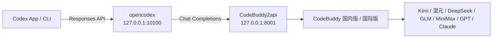

# codex-buddy

> 在 **OpenAI Codex** 里通过 **腾讯 CodeBuddy** 一次性使用大部分国产大模型：**Kimi K3**、**混元 Hy3**、**DeepSeek-V4**、**GLM-5.2**、**MiniMax-M3** 等。

[English](README.md) · [简体中文](README_ZH.md)

[](LICENSE)

`codex-buddy` 是一套本地代理配置，把 Codex 的 **Responses API** 桥接到 CodeBuddy 的 **Chat Completions**，让你能在 **Codex 桌面端 App / CLI** 里把 CodeBuddy 聚合的模型库当作 Codex 的大脑。



---

## 为什么用 CodeBuddy

与其在 Codex 里单独配置一个个模型商，不如通过 CodeBuddy 这个**统一网关**直接接入大部分国产大模型：

| 模型 | 版本 | 说明 |
|------|------|------|
| **Kimi K3** | 国内版 | Moonshot 最新模型；逐步放量，目前优先企业/订阅用户 |
| **Hy3 High** | 国内版 | 混元三代推理模型，**限时免费** |
| **GLM-5.2 / 5.1 / 5v-Turbo** | 国内版 | 智谱旗舰系列 |
| **MiniMax-M3** | 国内版 | 高性价比日常模型 |
| **Kimi-K2.7-Code / K2.6 / K2.5** | 国内版 | 编程优化与多模态版本 |
| **DeepSeek-V4-Pro / Flash High** | 国内版 | 推理模型 |
| **GPT-5 / Claude-4 / Gemini-2.5** | 国际版 | 通过 CodeBuddy 国际版 (`codebuddy.ai`) 使用 |

CodeBuddy 有**两个版本**：

| 版本 | 域名 | 登录 | 主要模型 |
|------|------|------|----------|
| **国内版** | `copilot.tencent.com` | 腾讯云账号 | Kimi、混元、DeepSeek、GLM、MiniMax |
| **国际版** | `codebuddy.ai` | CodeBuddy 账号 | GPT-5、Claude-4、Gemini-2.5，以及可配置的 OpenAI 兼容端点 |

两个版本都可通过 `CODEBUDDY_INTERNET_ENVIRONMENT` 由同一代理接入。

---

## 快速开始

### 1. 启动 CodeBuddy2api

```bash
./scripts/setup-codebuddy2api.sh
```

脚本会克隆 [`Sliverkiss/CodeBuddy2api`](https://github.com/Sliverkiss/CodeBuddy2api)、创建 Python 虚拟环境、安装依赖，并提示你填写 `CODEBUDDY_API_KEY`。编辑完 `CodeBuddy2api/.env` 后再次运行脚本即可启动，监听 `127.0.0.1:8001`。

如需使用**国际版**，在 `CodeBuddy2api/.env` 中设置：

```bash
CODEBUDDY_INTERNET_ENVIRONMENT=public
```

使用**国内版**（默认）：

```bash
CODEBUDDY_INTERNET_ENVIRONMENT=internal
```

验证启动成功：

```bash
curl http://127.0.0.1:8001/codebuddy/v1/models
```

### 2. 将 CodeBuddy 注册到 opencodex

```bash
npm install -g @bitkyc08/opencodex

ocx provider add codebuddy \
  --adapter openai-compatible \
  --base-url http://127.0.0.1:8001/codebuddy/v1 \
  --api-key dummy \
  --allow-private-network \
  --set-default \
  --sync
```

`--api-key dummy` 即可，真实鉴权在 CodeBuddy2api 层处理；`--allow-private-network` 必须加，因为代理跑在本地 `127.0.0.1`。

### 3. 启动网关并使用 Codex

```bash
ocx start
```

打开 **Codex App** 或运行 `codex`，CodeBuddy 的模型已出现在模型选择器中。

---

## 选择具体模型

使用 opencodex 的 `provider/model` 路由：

```bash
# CLI
codex -m "codebuddy/kimi-k3" "重构这个函数"
codex -m "codebuddy/hy3-high" "解释这个算法"
```

在 **Codex App** 中直接在模型选择器里挑选。想用可视化界面浏览可用模型，运行：

```bash
ocx gui
```

---

## 让 Codex 自己完成配置

把 [`PROMPT.md`](PROMPT.md) 的内容复制进 Codex 聊天，Codex 会自动完成安装、配置、启动和验证。

---

## 让 opencodex 常驻后台

不想一直开着终端：

```bash
ocx service install
ocx service start
```

随时停止或还原：

```bash
ocx stop        # 停止代理并恢复原生 Codex
ocx restore     # 仅恢复 Codex 配置，不停止代理
```

---

## 验证工具调用

在依赖 agent 功能前，先确认 CodeBuddy 会返回 `tool_calls`：

```bash
curl http://127.0.0.1:8001/codebuddy/v1/chat/completions \
  -H "Content-Type: application/json" \
  -d '{
    "model":"auto-chat",
    "messages":[{"role":"user","content":"用 calc 工具计算 1+1"}],
    "tools":[{"type":"function","function":{"name":"calc","description":"计算","parameters":{"type":"object","properties":{"expr":{"type":"string"}}}}}],
    "tool_choice":"auto"
  }'
```

如果返回包含 `"tool_calls"`，Codex 才能读文件、改代码、执行命令；否则说明你的 CodeBuddy 账号/模型尚未开通 function calling。

---

## 仓库结构

```
codex-buddy/
├── README.md                 # 英文版
├── README_ZH.md              # 本文件
├── PROMPT.md                 # 可粘贴给 Codex 自动执行
├── scripts/
│   └── setup-codebuddy2api.sh # 启动 CodeBuddy2api
├── TROUBLESHOOTING.md        # 常见问题
└── LICENSE                   # MIT
```

---

## License

[MIT](LICENSE)
